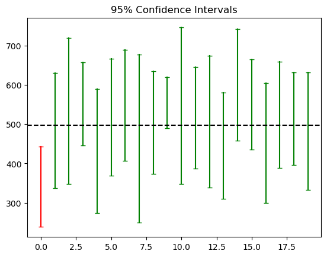
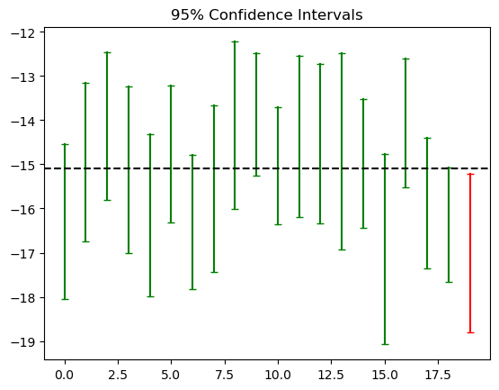

## Confidence Intervals

A confidence interval (CI) is a range of values which is likely to contain the true value of an unknown population parameter.

### Confidence Interval for a population mean

It is the sample mean plus/minus the margin of error:

$\bar{X} \pm MOE$

### Z-score vs T-score

#### Z-score:

**Assumptions**:
* The population variance is known.
* The sample size is large enough to assume normality of sample means according to the Central Limit Theorem.

${\large \bar{X}-Z_{1-\alpha/2}\frac{\sigma}{\sqrt{n}} \leq \mu \leq \bar{X}+Z_{1-\alpha/2}\frac{\sigma}{\sqrt{n}}}$

Where:
* $\alpha$ is the significance level.

    The significance level in a confidence interval is the fraction of the times the confidence interval doesn't contain the true population parameter, when sampling repeatedly. It is expressed as a number between 0 and 1. Common significance levels are 0.1, 0.05 and 0.01.

* $Z_{1-\alpha/2}$ is the standard score where the area under the standard normal density curve from $-\infty$ to $Z$ equals $1-\alpha/2$.
* $\frac{\sigma}{\sqrt{n}}$ is the standard error.

#### T-score:

**Assumptions**:
* Sample size is small or population variance unknown.
* The population is normally distributed.

${\large CI=\bar{X} \pm t_{1-\alpha/2,n-1}\frac{s}{\sqrt{n}}}$

### Confidence Level

The confidence level is set by the researcher. It describes the average amount of times the interval contains the true population parameter, when sampling repeatedly. It is the counterpart to the significance level ($\alpha$), often expressed as a percentage.


```python
import numpy as np
import matplotlib.pyplot as plt
from scipy.stats import t

# mu = 500, sigma = 200
X = np.random.normal(loc=500, scale=200, size=1000)

# draw random samples
def sample(n):
    copy = X.copy()
    np.random.shuffle(copy)
    return copy[:n]

def confidence_interval(alpha):
    x = sample(n=10)
    moe = t.ppf(1-alpha/2, df=len(x)-1) * (np.std(x, ddof=1) / np.sqrt(len(x)))
    return (np.mean(x) - moe, np.mean(x) + moe)

# plot confidence intervals
mu = np.mean(X)
for i in range(20):
    low, high = confidence_interval(alpha=0.05)
    if low <= mu <= high:  
        plt.plot([i, i], [low, high], "g_-")
    else:
        plt.plot([i, i], [low, high], "r_-")


plt.axhline(mu, c="black", linestyle="dashed")
plt.title("95% Confidence Intervals")
plt.show()
```


    

    


### Confidence Intervals for a difference in population means

Confidence intervals can be used to estimate the difference between means across two groups, providing a range of values that likely contains the true difference.

1. If the samples are dependent:

    $d = \bar{X_1} - \bar{X_2}$

    $\large CI(X_1,X_2)=\bar{d} \pm t_{1-\alpha/2,n-1}\frac{s_d}{\sqrt{n}}$

2. If the samples are independent:

    2.1 Population variances can be assumed to be equal:

    $$\large{CI(X,Y)=(\bar{X}-\bar{Y}) \pm t_{1-\alpha/2,n_X+n_Y-2} \sqrt{\frac{s^2_{pool}}{n_X} + \frac{s^2_{pool}}{n_Y}}}$$

    $\large{s^2_{pool} = \frac{(n_X-1)s^2_X + (n_Y-1)s^2_Y}{n_X + n_Y - 2}}$

    2.2 Population variances are assumed to be different:

    $\large{CI(X,Y)=(\bar{X}-\bar{Y}) \pm t_{1-\alpha/2,\nu} \sqrt{\frac{s^2_X}{n_X} + \frac{s^2_Y}{n_Y}}}$

    $\large{\nu = \frac{(s^2_X/n_X + s^2_Y/n_Y)^2}{(\frac{s^2_X}{n_X})^2/(n_X-1)+(\frac{s^2_Y}{n_Y})^2/(n_Y-1)}}$


```python
import numpy as np
from scipy.stats import t
import matplotlib.pyplot as plt

# population with mu=5 and sigma=2
X = np.random.normal(loc=5, scale=2, size=1000)

# population with mu=20 and sigma=2
Y = np.random.normal(loc=20, scale=2, size=1000)

# draw random samples
def sample(data, n):
    copy = data.copy()
    np.random.shuffle(copy)
    return copy[:n]

def confidence_interval(alpha):
    # pooled variance
    def poolvar(x, y):
        return ((len(x)-1) * np.var(x, ddof=1) + (len(y)-1) * np.var(y, ddof=1)) / (len(x) + len(y) - 2)
    
    x = sample(X, n=10)
    y = sample(Y, n=12)
    moe = t.ppf(1-alpha/2, df=len(x)+len(y)-2) * np.sqrt(poolvar(x, y) / len(x) + poolvar(x, y) / len(y))
    
    return (np.mean(x) - np.mean(y) - moe, np.mean(x) - np.mean(y) + moe)

print(f"""Difference: {np.mean(X) - np.mean(Y):.2f}
CI={confidence_interval(alpha=0.05)}""")
```

    Difference: -15.09
    CI=(np.float64(-17.297603298047285), np.float64(-14.177132183401243))


```python
diff = np.mean(X) - np.mean(Y)
for i in range(20):
    low, high = confidence_interval(alpha=0.05)
    if low <= diff <= high:
        plt.plot([i, i], [low, high], "g_-")
    else:
        plt.plot([i, i], [low, high], "r_-")

plt.axhline(diff, c="black", linestyle="dashed")
plt.title("95% Confidence Intervals")
plt.show()
```


    

    


### Common Misconception

A common misconception about confidence intervals is that a 95% confidence interval implies a 95% chance that the true value lies within the interval. That is not correct. The correct interpretation is that, when the same sampling procedure is continuously repeated, 95% of the resulting intervals will contain the true value.
